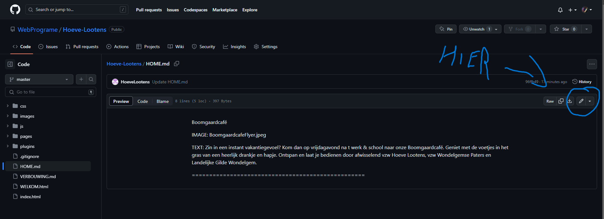
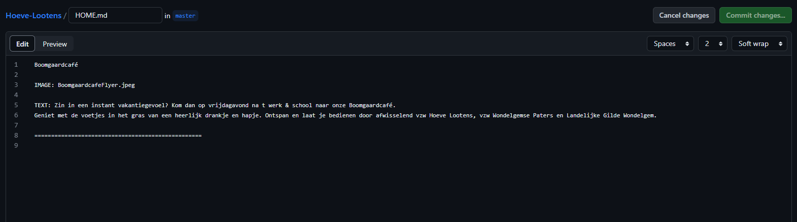
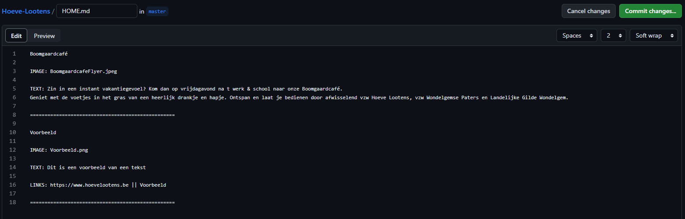

# Documentation

Hier vindt je een korte uitleg om de website Hoeve Lootens te bewerken.

## GitHub

Als u voor de eerste keer GitHub gebruikt zal u eerst moeten inloggen. Dit doe je als volgt:

- Ga naar [github.com](https://github.com/) en klik bovenaan rechts op "Sign in"
- Log dan in met de gegeven gegevens (voor veiligheids redenen kan je deze hier niet vinden).

Nu u ingelogt bent kan u een link onderaan kiezen aan de hand van de pagina die wenst te veranderen.

| Pagina  |  Link |
|---|---|
| Home  | [HOME.md](https://github.com/WebPrograme/Hoeve-Lootens/blob/master/HOME.md)  |
| Verbouwingen  | [VERBOUWING.md](https://github.com/WebPrograme/Hoeve-Lootens/blob/master/VERBOUWING.md)  |

Wanneer je de pagina gevonden hebt, klik je op het potloodje rechts van het scherm.

## Editen

Nu kan u veranderingen doen, hier is een korte samenvating.

Artikels worden onderscheiden door een reeks '=' tekens. Dus als u een nieuw artikel wilt toevoegen, werk je er onder of voeg je de tekens toe als deze er nog niet staan. HET IS BELANGRIJK DAT ER ALTIJD 50 TEKENS STAAN.

Op de eerste lijn van je nieuw artikel staat je titel. Dit kan meerdere woorden zijn.

Om een afbeelding toe te voegen, schrijf je op een nieuwe lijn het volgende:
`IMAGE:` vervolgt met de naam en het type van de afbeelding.
(bv. IMAGE: voorbeeld.png). Pasop! Er moet altijd een spatie tussen het dubbelpunt en de naam.

Om tekst toe te voegen, schrijf je op een nieuwe lijn het volgende:
`TEXT:` vervolgt met de gewenste tekst. Je kan op een volgende lijn verder schrijven als je een nieuwe paragraaf wilt starten.

### **Knoppen zijn alleen voor de HOME pagina**

Om een knop toe te voegen, schrijf je op een nieuwe lijn het volgende:
`LINKS:` vervolgt met de link naar een externe website of een interne pagina (zie de tabel onderaan voor de links). Na de link schrijf je '||' en ten slotte de tekst die u op de knop wilt. (bv. `LINKS: <https://www.hoevelootens.be> || Voorbeeld). Let op! Voor en na de '||' moet er een spatie.

Hier is een tabel voor de interne links:

| Pagina  |  Link |
|---|---|
| Verbouwingen  | pages/verbouwing.html |
| Kalender  | pages/kalender.html |
| Reserveren  | pages/reserveren.html |
| Maatschappelijke Projecten  | pages/maatschappelijk.html |
| Geschiedenis  | pages/geschiedenis.html |
| Contact  | pages/contact.html |
| Inschrijven voor activiteien  | pages/shop.html |
| Inschrijven voor eten  | pages/form.html |

***
Hier is een voorbeeld van een voor en na:

#### **VOOR**

#### **NA**

## Opslaan

Om op te slaan klikt u op de groene knop rechts. U kan een beschrijving en een titel geven als u dit wenst (Een beschrijving is niet verplicht maar handig als we vorige versies zoeken). Ten slotte klikt u op de groene knop.
